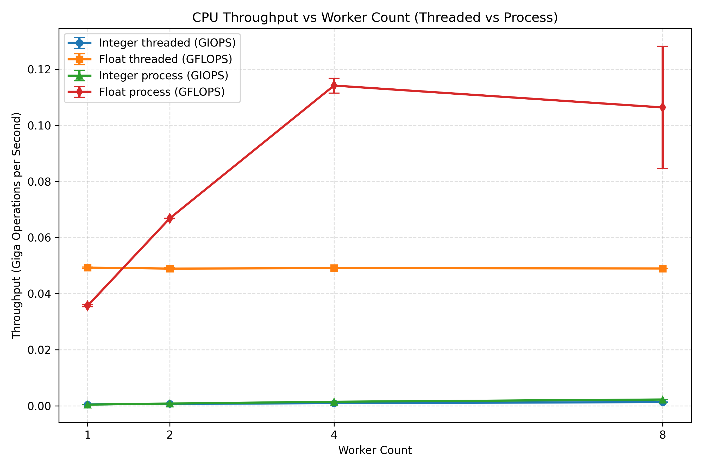

# Python CPU Benchmark (Threaded + Process)

This project benchmarks CPU throughput in Python for CPU-bound integer and floating-point workloads using:

- `threaded` mode (threads)
- `process` mode (multiprocessing)
- `both` mode (threaded + process comparison in one run)

For each worker count, the benchmark runs 3 trials and reports:

- per-run throughput
- average throughput
- sample standard deviation

Throughput is shown as:

- integer: `IOPS` and `GIOPS`
- float: `FLOPS` and `GFLOPS`

## Project Structure

- `benchmark.py` - CLI entrypoint and benchmark orchestration
- `utils/cli_utils.py` - CLI parsing/path normalization helpers
- `utils/stats_utils.py` - average, sample standard deviation, and 3-run stats aggregation
- `utils/threads_utils.py` - thread workers and thread manager
- `utils/processes_utils.py` - process workers and process manager
- `utils/plot_utils.py` - graph generation (single-mode and threaded-vs-process comparison)
- `tests/test_benchmark_utils.py` - utility tests (stats, CLI helpers, workers/managers)
- `tests/test_benchmark_cli.py` - CLI smoke tests per mode (`threaded`, `process`, `both`)

## Setup

### 1) Create and activate virtual environment

```bash
python3 -m venv .venv
source .venv/bin/activate
```

### 2) Install dependencies

```bash
.venv/bin/python -m pip install -r requirements.txt
```

## CLI Usage

### Default run

```bash
.venv/bin/python benchmark.py
```

### Arguments

- `--duration-seconds` (float, default: `3.0`)
- `--worker-counts` (comma-separated ints, default: `1,2,4,8`)
- `--output-file` (default: `benchmarks/benchmark_performance.png`)
- `--mode` (`threaded`, `process`, `both`; default: `threaded`)

### Examples

Run threaded mode:

```bash
.venv/bin/python benchmark.py --mode threaded --duration-seconds 5 --worker-counts 1,2,4,8 --output-file benchmarks/threaded.png
```

Run process mode:

```bash
.venv/bin/python benchmark.py --mode process --duration-seconds 5 --worker-counts 1,2,4,8 --output-file benchmarks/process.png
```

Run threaded vs process comparison:

```bash
.venv/bin/python benchmark.py --mode both --duration-seconds 1 --worker-counts 1,2,4,8 --output-file benchmarks/benchmark_process_vs_thread.png
```

## Output Behavior by Mode

- `threaded`: prints threaded integer/float benchmark stats and saves a 2-series graph.
- `process`: prints process integer/float benchmark stats and saves a 2-series graph.
- `both`: runs both backends, saves a 4-series comparison graph, and prints:
  - IOPS gain at the largest worker count (`process vs threaded`)
  - FLOPS gain at the largest worker count (`process vs threaded`)

## Sample Output Graph



## Run Tests

Run utility tests:

```bash
.venv/bin/python -m unittest tests.test_benchmark_utils -v
```

Run CLI smoke tests:

```bash
.venv/bin/python -m unittest tests.test_benchmark_cli -v
```

Run full test discovery:

```bash
.venv/bin/python -m unittest discover -s tests -v
```

## Notes

- CPython threads are constrained by the GIL for CPU-bound workloads.
- `process` and `both` modes are included for direct scaling/performance comparison against threads.

