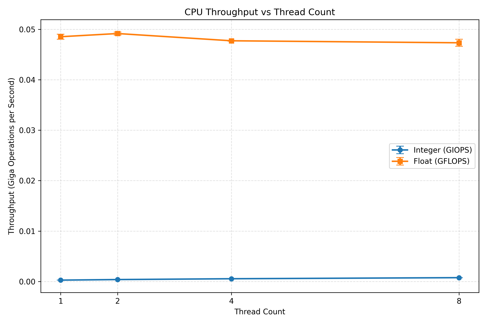

# Python Threaded CPU Benchmark (IOPS/FLOPS)

This project benchmarks CPU throughput in Python using threads for:
- Integer operations (`IOPS` / `GIOPS`)
- Floating-point operations (`FLOPS` / `GFLOPS`)

For each thread configuration, the benchmark runs 3 trials and reports:
- Per-run throughput
- Average throughput
- Sample standard deviation

It also generates a comparison graph with error bars.

## Project Structure

- `benchmark.py` - CLI entrypoint and benchmark orchestration
- `utils/cli_utils.py` - CLI parsing helpers (`parse_thread_counts`, `normalize_output_file`)
- `utils/stats_utils.py` - statistics helpers and 3-run calculation
- `utils/threads_utils.py` - integer/float workers and thread manager
- `utils/plot_utils.py` - graph generation
- `tests/test_benchmark_utils.py` - unit tests for utilities
- `tests/test_benchmark_cli.py` - CLI smoke test

## Setup

### 1) Create and activate virtual environment

```bash
python3 -m venv .venv
source .venv/bin/activate
```

### 2) Install dependencies

```bash
pip install -r requirements.txt
```

## Run from CLI

Run benchmark with default arguments:

```bash
python3 benchmark.py
```

Example with a custom arguments:

```bash
python3 benchmark.py --duration-seconds 5 --thread-counts 1,3,5,7 --output-file benchmarks/myGraph
```

## Sample Output Graph



## Run Tests

Run utility tests:

```bash
python3 -m unittest tests.test_benchmark_utils -v
```

Run CLI smoke test:

```bash
python3 -m unittest tests.test_benchmark_cli -v
```

Run full test discovery:

```bash
python3 -m unittest discover -s tests -v
```

## Notes

- The benchmark uses CPython threads for CPU-bound work.
- Because of the GIL, scaling with more threads may look flat.

